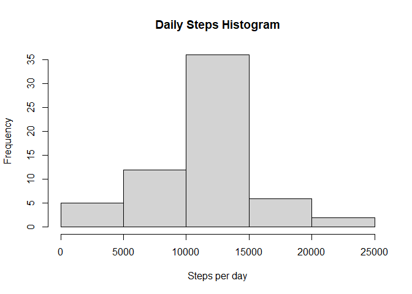

## Loading and preprocessing the data

```r
library(ggplot2)
unzip("activity.zip")
activity <- read.csv("activity.csv")
#Data without missing values
data <- activity[complete.cases(activity),]
dailysteps <- aggregate(steps ~ date, data, sum)
```


## What is the mean total number of steps taken per day?


```r
dailystepsNA <- with(activity, tapply(steps, as.factor(activity$date), sum, na.rm = T))
#Histogram
hist(dailystepsNA, main = "Daily Steps Histogram", xlab = "Steps per day", col = "red")
```

<!-- -->

Mean and median number of steps taken each day  

```r
summary(dailystepsNA)
```

```
##    Min. 1st Qu.  Median    Mean 3rd Qu.    Max. 
##       0    6778   10395    9354   12811   21194
```


## What is the average daily activity pattern?

```r
intervalsxsteps <- aggregate (steps ~ interval, data, mean)
#Time series plot
plot(intervalsxsteps$interval, intervalsxsteps$steps, type = "l", col = "blue",
     xlab = "Interval", ylab = "Average number of steps", main = "Average daily activity pattern")
```

<!-- -->

The 5-minute interval that, on average, contains the maximum number of steps is given by  the following code:  

```r
#Maximum number of steps according to interval 
maxstepsperinterval <- which.max(intervalsxsteps$steps)
intervalsxsteps[maxstepsperinterval,]
```

```
##     interval    steps
## 104      835 206.1698
```


## Imputing missing values

First we calculate the number of missing values

```r
#Missing values (6)
missing <- activity[!complete.cases(activity),]
#Total rows with NA values
nrow(missing)
```

```
## [1] 2304
```

```r
#New dataset will be stored separately
newData <- activity
```


The following function replaces NA values with the average steps for a given interval 

```r
#replacing NAs with avg steps per interval
for (i in 1:nrow(activity)){
           if(is.na(activity$steps[i])){
                      sub <- intervalsxsteps$steps[which(intervalsxsteps$interval == activity$interval[i])]
                      newData$steps[i] <- sub
           }
}
```

Histogram of newly created dataset

```r
hist(aggregate(steps ~ date, newData, sum)$steps, xlab = "Steps per day", main = "Daily Steps Histogram")
```

<!-- -->

Calculating mean and median, and comparing it to the old dataset:  

1. Summary of newly created data

```r
#Mean and median of newly created data
summary(aggregate(steps ~ date, newData, sum)$steps)
```

```
##    Min. 1st Qu.  Median    Mean 3rd Qu.    Max. 
##      41    9819   10766   10766   12811   21194
```

2. Summary of old data

```r
#Mean and median of the old dataset
summary(dailystepsNA)
```

```
##    Min. 1st Qu.  Median    Mean 3rd Qu.    Max. 
##       0    6778   10395    9354   12811   21194
```


## Are there differences in activity patterns between weekdays and weekends?

The following function classifies dates by filtering weekdays using the if() function 

```r
#Weekdays and weekends
weekday <- function(dates) {
           day <- weekdays(as.Date(dates, '%Y-%m-%d'))
           if  (!(day == 'Saturday' || day == 'Sunday')) {
                      x <- 'Weekday'
           } else {
                      x <- 'Weekend'
           }
           x
}
```

Panel plot comparing the average number of steps taken per 5-minute interval across weekdays and weekend

```r
#Adding new weekend/weekday column
newData$day_type <- as.factor(sapply(newData$date, weekday))

#Plotting according to weekdays and weekends
ggplot(aggregate(steps ~ interval+day_type, newData, mean), aes(interval, steps)) +
           facet_grid(day_type ~ ., scales = "fixed", space = "fixed") +
           geom_line(stat = "identity", aes(colour = day_type)) + 
           labs(title = "Number of steps per interval and day type", x = "Interval", y = "Steps")
```

<!-- -->

The plot shows clear differences between weekends and weekdays, however the variation isn't enormous.
